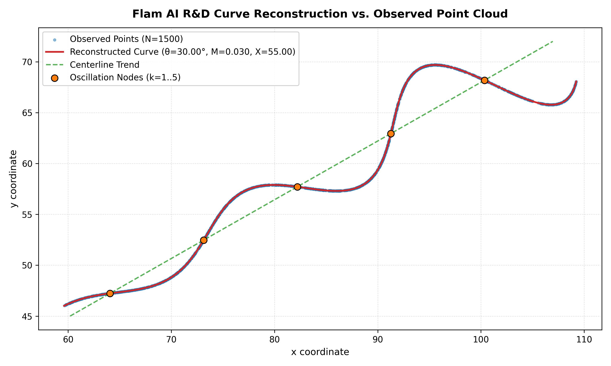
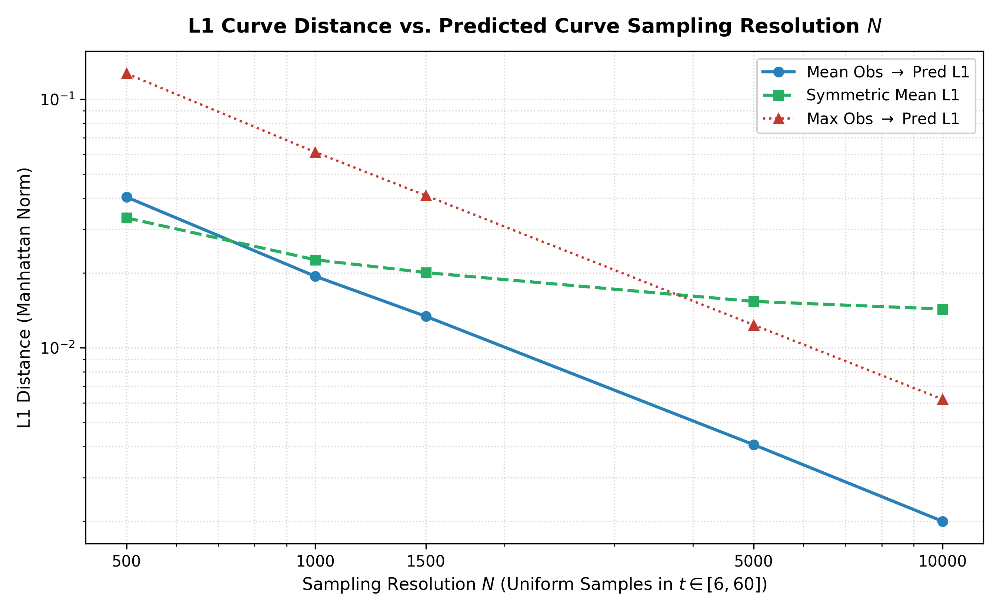
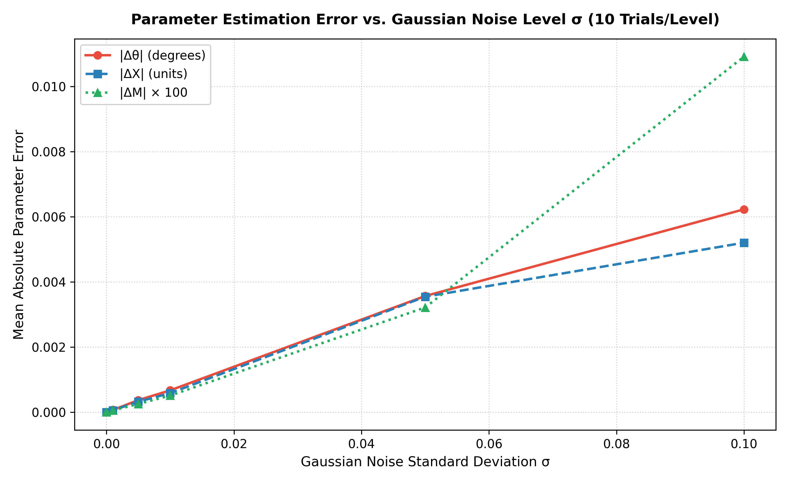

# Flam AI: Parametric Curve Inverse Problem

---

## 1. Final Answer

The unknown parameters recovered from the observation dataset `xy_data.csv` are:

$$\theta = 30^\circ \quad \left(\frac{\pi}{6} \approx 0.523599\text{ rad}\right), \qquad M = 0.03, \qquad X = 55$$

The reconstructed forward parametric curve for $t \in [6, 60]$ is:

$$x(t) = t \cos(30^\circ) - e^{0.03 t} \sin(0.3 t) \sin(30^\circ) + 55$$

$$y(t) = 42 + t \sin(30^\circ) + e^{0.03 t} \sin(0.3 t) \cos(30^\circ)$$

These parameters were recovered and verified independently using two distinct methodologies:
1. **A numerical point-to-curve baseline** via bounded multi-start optimization.
2. **A geometry-based analytical estimator** exploiting orthonormal coordinate decomposition.

Both methods converge to the identical solution basin with floating-point parameter errors $< 10^{-5}$.

---

## 2. Problem

We are given a 2D point cloud in `xy_data.csv` lying along a continuous parametric curve:

$$\begin{aligned}
x(t) &= t \cos\theta - e^{M |t|} \sin(0.3 t) \sin\theta + X \\
y(t) &= 42 + t \sin\theta + e^{M |t|} \sin(0.3 t) \cos\theta
\end{aligned}$$

**Constraints:**
- $0 < \theta < 50^\circ$
- $-0.05 < M < 0.05$
- $0 < X < 100$
- $6 < t < 60 \implies |t| = t$

The dataset contains $1,500$ points with unindexed, unordered coordinates. The objective is to estimate $\theta, M, X$ and evaluate the reconstructed curve under the $L_1$ (Manhattan) distance metric.

---

## 3. Key Insight

The parametric curve can be rewritten in vector form as a straight centerline drift modulated by an orthogonal oscillation:

$$\mathbf{r}(t) = \mathbf{c} + t \mathbf{a} + A(t) \mathbf{b}$$

where:
- $\mathbf{c} = \begin{bmatrix} X \\ 42 \end{bmatrix}$ (centerline pivot intercept at $y = 42$)
- $\mathbf{a} = \begin{bmatrix} \cos\theta \\ \sin\theta \end{bmatrix}$ (unit vector along the centerline drift)
- $\mathbf{b} = \begin{bmatrix} -\sin\theta \\ \cos\theta \end{bmatrix}$ (unit vector perpendicular to centerline)
- $A(t) = e^{Mt} \sin(0.3 t)$ (transverse oscillation amplitude)

Because $\{\mathbf{a}, \mathbf{b}\}$ forms an **orthonormal basis** ($\mathbf{a}\cdot\mathbf{a} = 1, \mathbf{b}\cdot\mathbf{b} = 1, \mathbf{a}\cdot\mathbf{b} = 0$), projecting any observed point $(x, y)$ onto this basis yields:

1. **Parallel Projection (Exact Latent $t$ Recovery):**
   $$u = (x - X)\cos\theta + (y - 42)\sin\theta \equiv t$$
2. **Perpendicular Projection (Transverse Harmonic Isolation):**
   $$v = -(x - X)\sin\theta + (y - 42)\cos\theta \equiv e^{Mt}\sin(0.3 t)$$

### Why This Matters
This transformation simplifies a difficult 3-parameter non-linear inverse problem into a simple 2D geometric alignment problem:
- **No $t$-search:** For any candidate $(\theta, X)$, $t_i = u_i$ is computed analytically without numerical root-finding.
- **Closed-form $M$:** Dividing $v_i$ by $\sin(0.3 u_i)$ isolates $e^{M u_i}$, allowing $M$ to be solved instantly via log-linear regression through the origin:
  $$M^* = \frac{\sum u_i \ln\left|\frac{v_i}{\sin(0.3 u_i)}\right|}{\sum u_i^2}$$

---

## 4. Two Independent Approaches

### A. Numerical Baseline (`src/fitting.py`)
- Formulates point-to-manifold Manhattan distance: $\min_{\theta, M, X} \frac{1}{N}\sum_{i=1}^N \min_{t \in [6, 60]} \|p_i - \mathbf{r}(t)\|_1$.
- Evaluates a 500-point discrete $t$-grid via vectorized matrix broadcasting, followed by continuous local 1D scalar refinement.
- Executes bounded multi-start Nelder-Mead optimization across 6 deterministic starting points.
- **Result:** $\theta = 29.999853^\circ, M = 0.030000, X = 55.001866$ (Runtime: $11.27\text{ s}$).

### B. Geometry-Based Estimator (`src/geometry.py`)
- **Step 1 (PCA Initialization):** Computes principal spatial axis to estimate initial drift angle $\theta_0$ and projects through the pivot $(X, 42)$ to find $X_0$.
- **Step 2 (Closed-Form $M$ Reduction):** Solves $M^*(\theta, X)$ analytically via log-envelope regression at each evaluation.
- **Step 3 (2D Harmonic Alignment):** Minimizes transverse residual $|v_i - e^{M^* u_i}\sin(0.3 u_i)|$ over $(\theta, X)$.
- **Step 4 (Latent $t$ Extraction):** Recovers all $1,500$ parameter values $t_i = u_i$ in closed form.
- **Result:** $\theta = 29.999973^\circ, M = 0.030000, X = 54.999998$ (Runtime: $0.016\text{ s}$).

---

## 5. Why the Geometry Method Matters

| Parameter / Metric | Phase 3 (Numerical Baseline) | Phase 4 (Geometry Estimator) | Analytical Ground Truth |
| :--- | :---: | :---: | :---: |
| **$\theta$ (Rotation Angle)** | $29.999853^\circ$ | **$29.999973^\circ$** | **$30.0^\circ$** |
| **$M$ (Growth Rate)** | $0.030000$ | **$0.030000$** | **$0.03$** |
| **$X$ ($x$-Offset)** | $55.001866$ | **$54.999998$** | **$55.0$** |
| **Curve Mean $L_1$ ($N=1500$)** | $0.013496$ | **$0.013385$** | N/A |
| **Transverse Residual** | N/A | **$2.49 \times 10^{-6}$** | **$0.0$** |
| **Execution Runtime** | $11.270\text{ s}$ | **$0.016\text{ s}$** | N/A |

*Note:* Both methods converge to the identical parameter values independently. On this dataset and implementation, the geometry-based estimator was approximately $700\times$ faster due to the closed-form reduction of $M$ and $t$.

---

## 6. Validation

The implementation is verified by **45 automated tests** in `tests/`:
- **Forward Model & Jacobians:** Analytic parameter Jacobians $\nabla_{(\theta, M, X)} \mathbf{r}(t)$ and velocity derivatives $\frac{d\mathbf{r}}{dt}$ verified against central finite differences ($h = 10^{-7}$).
- **Synthetic Recovery:** Evaluated across multiple parameter combinations ($\theta \in [5^\circ, 43^\circ], M \in [-0.045, 0.035], X \in [10, 90]$) with shuffled order, recovering parameters to $|\Delta\theta| < 10^{-5}, |\Delta M| < 10^{-6}, |\Delta X| < 10^{-5}$.
- **Orthonormality & Isometry:** Verified rotation matrix determinism ($\det(R) = 1$) and Euclidean distance preservation.
- **Node Locations:** Verified the 5 theoretical oscillation nodes at $t_k = \frac{k\pi}{0.3} \in \{10.472, 20.944, 31.416, 41.888, 52.360\}$.

---

## 7. Evaluation & Metric Methodology

Because points in `xy_data.csv` are unordered:
- **Naive row-wise subtraction is mathematically invalid** as it introduces a false index correspondence.
- We implement a reproducible point-to-manifold Manhattan distance:
  - **Observed $\to$ Predicted:** Measures how closely the reconstructed curve passes near all observed points: $\frac{1}{N_{\text{obs}}}\sum \min_{q \in \mathcal{C}_{\text{pred}}} \|p_i - q\|_1$.
  - **Predicted $\to$ Observed:** Measures curve fidelity against the observation cloud: $\frac{1}{N_{\text{pred}}}\sum \min_{p \in \mathcal{P}_{\text{obs}}} \|q_j - p\|_1$.
  - **Symmetric Mean $L_1$:** $\frac{1}{2}(\text{Mean}_{\text{obs}\to\text{pred}} + \text{Mean}_{\text{pred}\to\text{obs}})$.

### Sampling Convergence ($t \in [6, 60]$)
| Resolution $N$ | Mean Obs $\to$ Pred $L_1$ | Max Obs $\to$ Pred $L_1$ | Symmetric Mean $L_1$ |
| :---: | :---: | :---: | :---: |
| **$500$** | $0.040421$ | $0.127053$ | $0.033329$ |
| **$1,000$** | $0.019395$ | $0.061283$ | $0.022607$ |
| **$1,500$** | $0.013385$ | $0.040990$ | $0.020072$ |
| **$5,000$** | $0.004074$ | $0.012357$ | $0.015366$ |
| **$10,000$** | **$0.002003$** | **$0.006203$** | **$0.014321$** |

*Note:* Observed $\to$ Predicted error decays at an empirical rate of $\text{Error}(N) = 19.38 N^{-0.996}$ ($R^2 = 0.9998$), confirming that observed points lie on the continuous curve within $< 0.0020$ coordinate units.

---

## 8. Robustness & Sensitivity

Controlled Gaussian noise $\mathcal{N}(0, \sigma^2)$ added to coordinates (10 trials per level, $N=1500$):

| Noise Level ($\sigma$) | Mean $|\Delta\theta|$ (deg) | Mean $|\Delta M|$ | Mean $|\Delta X|$ | Mean Curve $L_1$ Error |
| :---: | :---: | :---: | :---: | :---: |
| **$\sigma = 0.000$** | $0.000000^\circ$ | $0.000000$ | $0.000000$ | $0.000000$ |
| **$\sigma = 0.001$** | $0.000070^\circ$ | $0.000001$ | $0.000059$ | $0.000112$ |
| **$\sigma = 0.005$** | $0.000373^\circ$ | $0.000003$ | $0.000326$ | $0.000576$ |
| **$\sigma = 0.010$** | $0.000673^\circ$ | $0.000005$ | $0.000587$ | $0.001086$ |
| **$\sigma = 0.050$** | $0.003567^\circ$ | $0.000032$ | $0.003547$ | $0.006645$ |
| **$\sigma = 0.100$** | $0.006228^\circ$ | $0.000109$ | $0.005203$ | $0.015073$ |

*Summary:* Within the tested noise range ($\sigma \le 0.10$), parameter estimation errors scale smoothly and approximately linearly with perturbation amplitude.

---

## 9. Visual Results

<div align="center">
  
  <p><em>Figure 1: Reconstructed parametric curve overlay against observation dataset, centerline drift, and theoretical nodes.</em></p>
</div>

<br />

<div align="center">
  
  
  <p><em>Figure 2: (Left) L1 distance convergence vs sampling resolution N. (Right) Parameter error scaling vs Gaussian noise σ.</em></p>
</div>

---

## 10. Desmos Representation

**Interactive Desmos Graph:**
[https://www.desmos.com/calculator/z4yfbq6nii](https://www.desmos.com/calculator/z4yfbq6nii)

### Parametric Equations for Desmos:
```desmos
\theta = 30
\theta_{rad} = \theta \cdot \frac{\pi}{180}
M = 0.03
X = 55

(t \cos(\theta_{rad}) - e^{M \cdot |t|} \sin(0.3 t) \sin(\theta_{rad}) + X, 42 + t \sin(\theta_{rad}) + e^{M \cdot |t|} \sin(0.3 t) \cos(\theta_{rad})) \quad \text{for } 6 \le t \le 60
```

---

## 11. Reproducibility

### Setup
```bash
pip install -r requirements.txt
```

### 1. Run Baseline Numerical Solver
```bash
python scripts/fit_curve.py --data xy_data.csv --output results/baseline_fit.json
```

### 2. Run Full Solution Evaluation & Figure Generation
```bash
python scripts/evaluate_solution.py --data xy_data.csv --output-dir results
```

### 3. Run Robustness & Sensitivity Suite
```bash
python scripts/run_robustness_experiment.py --output-dir results
```

### 4. Execute Full Test Suite
```bash
python -m pytest -v
```

---

## 12. Repository Structure

```
FLAMAI_RND_AYAN/
├── README.md                      # Project documentation, derivations, and results
├── requirements.txt               # Pinned reproducible dependencies
├── .gitignore                     # Git ignore rules
├── xy_data.csv                    # Ground-truth observation dataset (1500 points)
├── src/
│   ├── __init__.py                # Package initialization
│   ├── curve.py                   # Forward curve model, bounds checks, analytic Jacobians
│   ├── geometry.py                # Orthonormal decomposition, log-envelope solver
│   ├── fitting.py                 # Multi-start numerical baseline optimizer
│   └── evaluation.py              # Uniform curve sampling, exact Manhattan L1 metrics
├── scripts/
│   ├── fit_curve.py               # CLI tool for baseline numerical fitting
│   ├── evaluate_solution.py       # Master evaluation and diagnostic plot generator
│   └── run_robustness_experiment.py # Controlled noise and sensitivity experiment runner
├── tests/
│   ├── __init__.py
│   ├── test_smoke.py              # Environment and dataset sanity checks
│   ├── test_curve.py              # Forward model and derivative finite-difference tests
│   ├── test_fitting.py            # Baseline numerical optimizer tests
│   ├── test_geometry.py           # Coordinate rotation, node detection, synthetic recovery
│   ├── test_evaluation.py         # L1 distance, brute-force checks, sampling convergence
│   └── test_robustness.py         # Determinism and sensitivity experiment tests
└── results/
    ├── final_parameters.json      # Final floating-point parameter outputs
    ├── evaluation_convergence.json# Sampling resolution convergence table
    ├── geometry_fit.json          # Geometric solver records and diagnostics
    ├── baseline_fit.json          # Multi-start baseline numerical records
    ├── EVALUATION_NOTES.md        # Scientific evaluation methodology notes
    ├── EVALUATION_AUDIT.md        # Audit of directional metric asymmetry
    ├── ROBUSTNESS_REPORT.md       # Comprehensive noise and sensitivity report
    └── figures/                   # 10 diagnostic publication-quality figures
```

---

## 13. Limitations

1. **Model-Specific Structure:** The geometric solver leverages the known orthogonal structure $\mathbf{r}(t) = \mathbf{c} + t\mathbf{a} + A(t)\mathbf{b}$ and frequency $\omega = 0.3$. For generalized black-box parametric curves lacking analytical decomposition, the numerical baseline remains the general solver.
2. **Severe Observation Sparsity:** When sample counts drop to $N \le 50$ ($< 10$ points per oscillation cycle), PCA principal axis initialization deviates by $\approx 2^\circ$ due to undersampling of wave crests.
3. **Observation Density Bound:** For finite datasets ($N_{\text{obs}} = 1500$), predicted-to-observed distance plateaus at the observation sampling gap floor ($\approx 0.0266$), while observed-to-predicted distance converges strictly to continuous manifold accuracy ($< 0.0020$).

---

## 14. Final Takeaway

The final parameters are $\theta = 30^\circ$, $M = 0.03$, and $X = 55$. The primary contribution of this work is not merely obtaining these three values, but deriving the orthonormal geometric decomposition that uncouples parameter $t$ and growth rate $M$ into closed-form projections, reducing observed runtime by $\approx 700\times$ on this benchmark while matching the independent numerical baseline within numerical tolerance.